## 两个弗里达 Las Dos Fridas

图片源自 弗里达·卡洛 官方网站 https://www.fridakahlo.org/images/paintings/the-two-fridas.jpg

画家：弗里达·卡罗 

绘制年份：1939年

材质类型：布面油画 

主题类型：肖像画 

时期/运动：超现实主义、象征主义、朴素艺术 

大小：173.5 x 173 厘米 

现藏地：墨西哥城现代艺术博物馆 

收购细节：1947 年由墨西哥城的 Nacional de Bellas Artes 艺术馆以 4,000 比索购买。 

## 摘要

​	本文从弗里达的生平介绍开始，围绕着《两个弗里达》的绘画内容、颜色、视角与大小对画作进行了详细分析，然后结合象征符号、墨西哥政治、绘画文化、女性意识、医学解剖、疾病、死亡等等角度对《两个弗里达》所蕴含的含义进行分析，给出了作者对于《两个弗里达》中体现的多个二元性的思考，最后结合同样是女性笔下的文学作品《那不勒斯四部曲》笔者给出了自身对于女性笔下的女性作品的特征的思考。

## 弗里达介绍

​	弗里达·卡洛在1907年出生于墨西哥的科约阿坎区，是世界艺术史上著名的女艺术家。弗里达的父亲是出生在德国的犹太人，是一位才华横溢的摄影师。弗里达的母亲是梅斯蒂索人，指西班牙和墨西哥原住民的混血女性，信仰天主教。

​	弗里达的一生与疾病与痛苦相伴。在6岁的时候，她患上了小儿麻痹症，她的右腿因此比左腿短了一截。在18岁的时候，她遭遇了一场非常严重的车祸。她所乘坐的巴士撞上了正在行驶了有轨电车，弗里达险些丧命。尽管从死神手中逃脱了出来，弗里达的脊椎、背部、脚掌、腿部都遭受到了严重的骨折与粉碎，一根钢管还穿过了她的腰刺透了她的阴道。在车祸后，弗里达瘫痪了，也因此一生都活在车祸后的慢性疼痛中。但她父母并没有因此放弃她，为治疗弗里达花光了家中的积蓄。因为瘫痪，弗里达终日只能躺在床上，她的父母为她特别定制了一个画架，还在床顶贴了一个大镜子，使得弗里达可以在床上对着镜子画自画像。

​	在康复训练后，弗里达能独立行走了。她带着她的画作找到了当时负有盛名的墨西哥壁画家迭戈，迭戈非常赏识弗里达的画作，并将她介绍给艺术界的人脉。1929年，年仅22岁的弗里达与43岁的迭戈相爱并结婚。弗里达与迭戈的爱情是混乱、动荡却又坚定的。迭戈有无数不正当的婚外关系，弗里达也在这之后有过几段婚外情。直到弗里达发现迭戈与自己的亲生妹妹有不正当关系，弗里达心生绝望与迭戈离婚。在此期间弗里达扔掉了迭戈喜欢的墨西哥传统服饰，换上了当时只有男人才穿的西装，剪掉了自己的长发。在此期间，她创作了著名的《两个弗里达》（图一）以及《短发的自画像》（图二）。但不到一年时间，他们复婚了，他们都坚信对方是自己生命中的挚爱。迭戈说弗里达是他生命中伟大的存在，而弗里达说：“我一生中发生过两次意外，一次是巴士车祸，一次是迭戈，而后者是最严重的。”

图一：《两个弗里达》

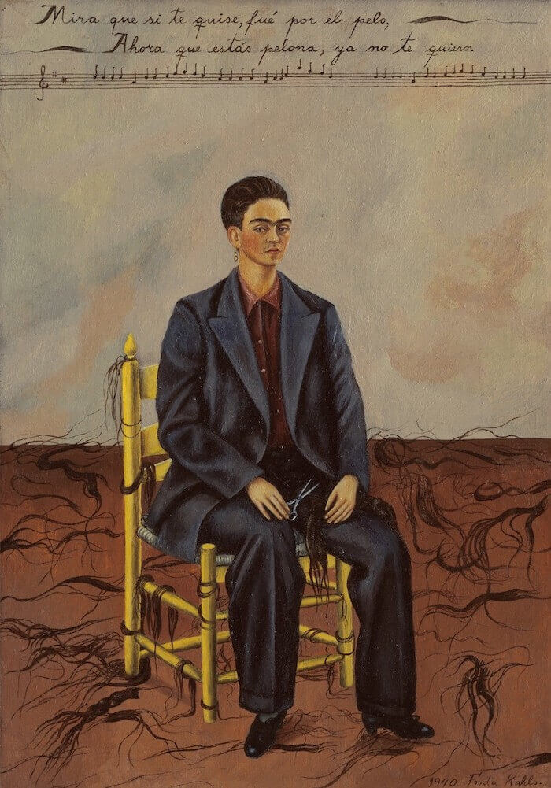

图二：《短发的自画像》（https://www.fridakahlo.org/self-portrait-with-cropped-hair.jsp）

​	弗里达曾经三度怀孕，却最终都因为车祸后的身体条件不适宜而流产，终生无法生育。在第一次流产之后，她绘制了著名的《亨利福特医院》（图三），溢满了母性的悲伤。弗里达不仅是一个画家，她同时也是时尚圈的名人。在巴黎举行画展的时候，她登上了著名时尚杂志Vogue的封面。她鲜明、大胆的穿衣搭配风格，明亮多彩的发型装扮，深深影响了众多时装界设计师。

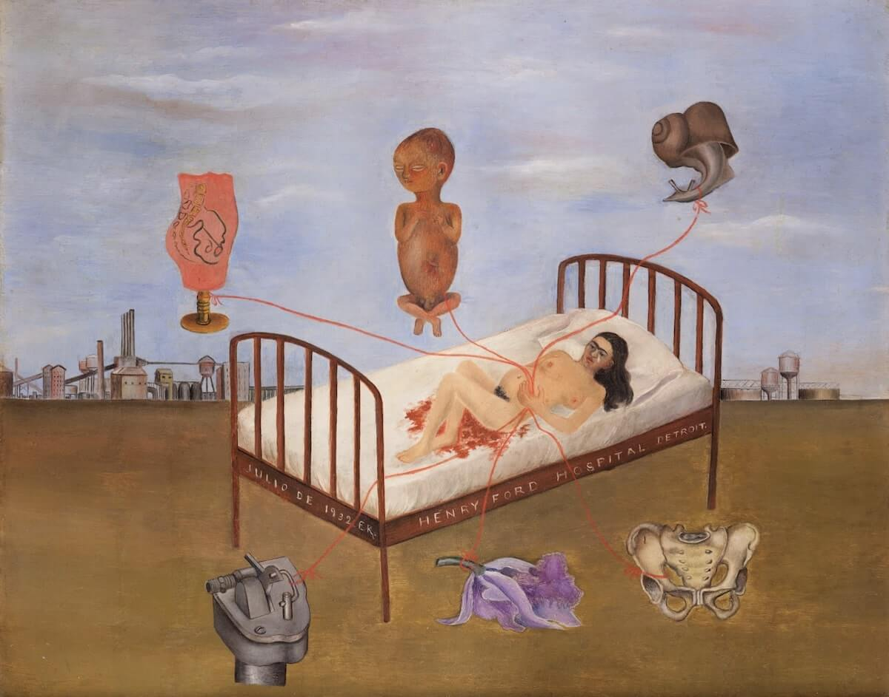

图三：《亨利福特医院》（https://www.fridakahlo.org/henry-ford-hospital.jsp）

## 图片介绍

​	谈起弗里达，人们印象最为深刻的就是她的自画像中的一字眉。在弗里达143幅作品中，有55幅是自画像，其中最为著名的要数《两个弗里达》。下面笔者主要从内容、颜色、视角和画作大小来介绍《两个弗里达》。

### 内容

​	在画作《两个弗里达》中，两位女性坐在似乎是藤编的椅子上。如果仔细看我们会发现这两个女性都是弗里达。她们都有着浓密黑黢的一字连眉，一双冷峻、坚定的眼睛，刻意突出的女性唇部汗毛（图四、图五）。

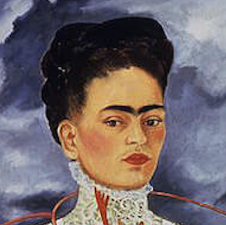

图四：左侧弗里达脸部

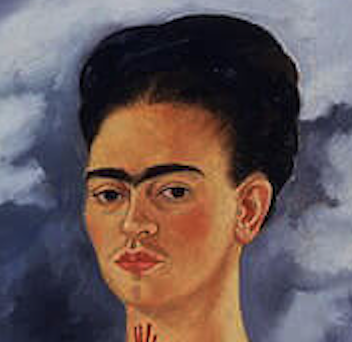

图五：右侧弗里达脸部

​	坐在右边的弗里达身着她的丈夫迭戈最爱的墨西哥传统服饰tehuana裙，眼神平静而有力量。右边的弗里达的心脏被放置在了tehuana裙的外面，鲜红而又真实，心脏连接的一根大动脉沿着弗里达的左手手臂缠绕向下，最终连接到了弗里达左手握着的一个椭圆形小肖像上（图六）。这个小肖像是弗里达的丈夫迭戈小时候的肖像（图七）。tehuana裙和肖像画部分说明了，右边的弗里达是迭戈深爱的弗里达，也是由迭戈的爱支撑着的弗里达。

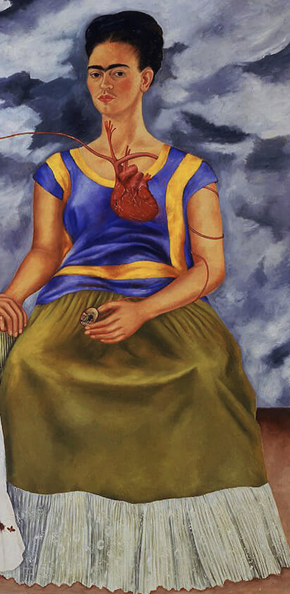

图六：右侧弗里达

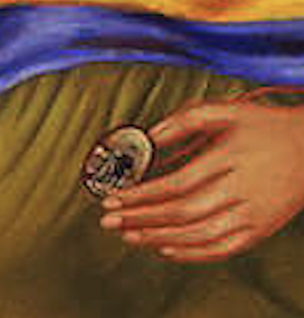

图七：小时候的迭戈画像

​	右边的弗里达的心脏还有一根血管链接到了左边的弗里达的心脏上。尽管有同样的一字眉，左边的弗里达的发型和妆容都更加欧式，另外她还身着维多利亚时代的蕾丝婚纱，和她母亲穿的婚纱类似。与右边的心脏不同，左边的弗里达的心脏露出的是解剖面，令人感觉更加“脆弱”。并且，不同于右边的心脏“浮于”衣服上，左边的弗里达的心脏嵌在了身体里，周围的衣服也因为展示心脏而破碎撕裂。除了与右边的弗里达心脏连接，左边的弗里达的心脏还有一根血管直接蜿蜒而落，尽头被弗里达右手持握的手术钳钳住。先前剪短血管而溢出的血溅落在了左侧弗里达的维多利亚风格的裙子上，滴落了两层。血的颜色与裙子的花朵飞鸟的颜色极为接近（图八）。

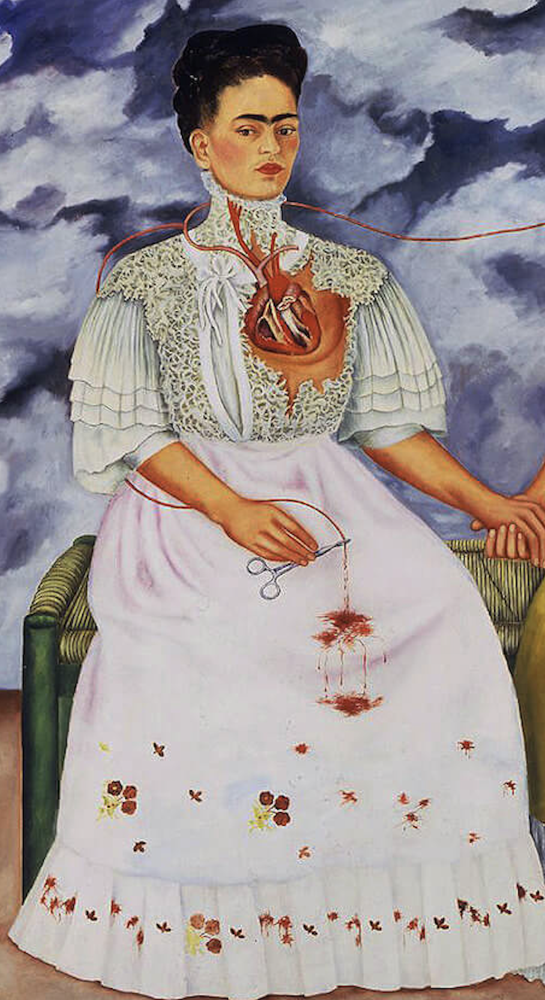

图八：左侧弗里达

​	两个弗里达不仅坐在一张椅子上，由同一个血管所连接（图九），她们的双手也是交握的（图十）。

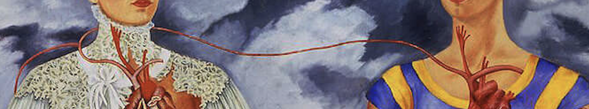

图九：连接两个弗里达的血管

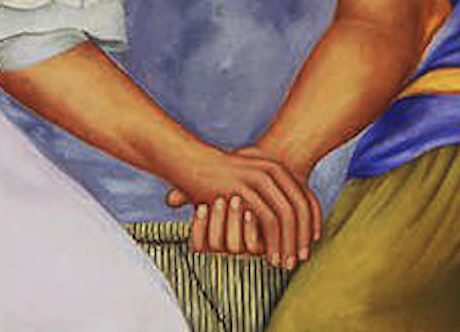

图十：两个弗里达的手相握

### 颜色、视角与大小

​	从绘画颜色来看，弗里达使用了油彩绘制了这张画。整体的颜色没有特别艳丽，即使是tehuana裙的明蓝和橘黄，也不会太过明亮。画作中的背景是深沉浓密的乌云（图十一），颜色阴郁，也暗示着一种阴沉的氛围。

图十一：背景乌云

​	《两个弗里达》的画作结构比较简单，视角也属于平视类型的自画像，描绘的事物也比较简单，没有其他复杂的背景和东西，也没有特别明显的立体感和真实的透视画法，整体而言较为平面。但天空与地面交汇处的阴影以及一些褶皱下、连接处的阴影，也确实给出了一些关于立体的概念。

​	《两个弗里达》是弗里达最大的自画像，长宽均达1.73米，几乎和真人的尺寸比例一样大。弗里达其他的自画像都很小，因为瘫痪在床时在如此限制的条件下，自己的身体是一个非常便捷的主题，而画的尺寸也因为病床条件而受到限制。与真人尺寸大小接近的画作，让人在观赏的同时，也能感受两个弗里达直视的灼烈目光，进而对这幅画作的背景以及内涵进行深层次的思考与追问。

## 文化、政治、女性、疾病与二元性

​	下面笔者将结合文化、政治、女性、疾病与二元性等多个角度介绍《两个弗里达》背后蕴含的弗里达的独特表达与风格。

### 象征符号

​	弗里达的画作中经常会出现一些意象符号。正如前文提到，她的母亲是虔诚的天主教徒，所以尽管弗里达本人不信教，天主教的意象还是会渗透到她的画作中。她经常使用刺、荆棘来比喻天主教中的殉难，并且也会结合蜂鸟和阿兹特克的神话符号（图十二）。她也非常熟悉耶稣圣心，也会在自画像中自己画成面无表情的形象（图十三），就像众多画作中天主教圣徒的形象一样。同样的血在她的作品中也经常出现，暗喻着她所经历的痛苦。另外，在早期的画作中弗里达也会用血来暗示结合。对于因车祸导致的瘫痪屡次流产、终生无法生育的弗里达来说，血色也意味着母性与生育。另外，在流血的心脏是天主教的象征，也是阿兹特克祭祀仪式的象征（图十四及图十五）。因此，《两个弗里达》中非常醒目的流血的心脏，既是弗里达受到宗教、文化影响的结果，也是弗里达希望表达的疼痛、结合、生育的表现。

图十二：《戴荆棘项链和蜂鸟的自画像》（https://www.fridakahlo.org/self-portrait-with-thorn-necklace-and-hummingbird.jsp#prettyPhoto）

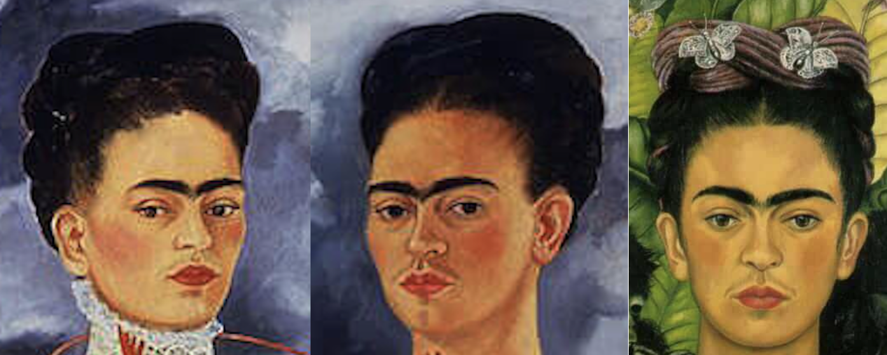

图十三：面无表情的弗里达（截取自《两个弗里达》和《戴荆棘项链和蜂鸟的自画像》）

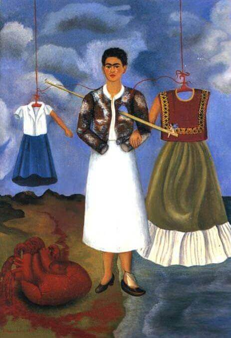

图十四：《记忆，心》（https://www.fridakahlo.org/memory-the-heart.jsp）

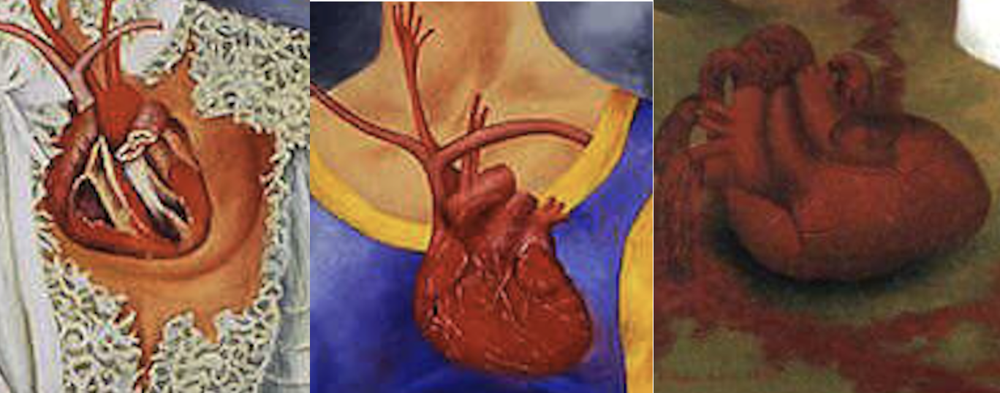

图十五：弗里达画中的心脏（截取自《两个弗里达》和《记忆、心》）

### 墨西哥政治思潮及其带来的文化以及女性主义

#### 墨西哥政治思潮

​	弗里达在世期间参加了社会主义政治、墨西哥民族主义运动，并且支持墨西哥文化认同运动，她与1927年加入了墨西哥共产党，1936年加入了叫做第四国际的社会主体团体。出于对墨西哥革命的认同，出生在1907年的弗里达将自己的出生日期改为墨西哥革命发生的1910年。墨西哥革命不仅带来了各地的政治思潮，也带来了墨西哥的文化复兴运动以及女性主义思潮，也是接下来提到的两点。

#### 墨西哥绘画文化的影响

​	1910年，墨西哥爆发革命，同时革命也引起了一场文化复兴。弗里达受到墨西哥民间艺术ex-Votes（也称retablos）影响，创作了大量小型自画像。ex-Votes是一些未受过专业绘画训练的艺术家在小型的画布上绘画的廉价画，通常由锡制作而成，涵盖的主题非常广泛，画的四周通常用文字描述了事件的经过。由于画的面积小，所以视角和生动性都不再重要，图像被简化为了最基础的形状与特征。ex-Votes在四周用文字叙述的特点以及精简的图像启发了弗里达，弗里达进而在画作中将自己想要表达的东西简化成具有特点的小图像，像文字一样加在画作中的各个地方。比如典型的《我所见到的水中景物或水的赐予》（图十六）以及《亨利福特医院》（图十七）。

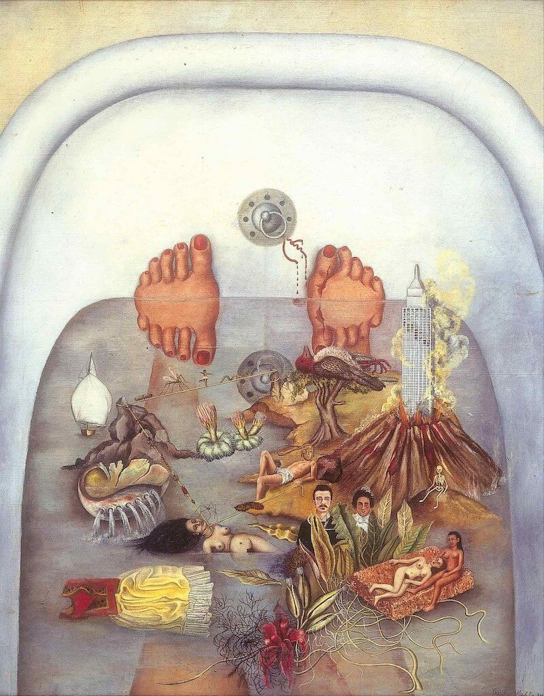

图十六：《我所见到的水中景物或水的赐予》（https://www.fridakahlo.org/what-the-water-gave-me.jsp）

图十七：《亨利福特医院》（https://www.fridakahlo.org/henry-ford-hospital.jsp）

​	弗里达同样还受到墨西哥19世纪的肖像画家的影响。这些时期，大多数的画家都没有接受过正规的绘画训练，尽管他们技艺同样娴熟，但他们所绘制的肖像画中人物的姿势较为僵硬，面部表情也比较冷淡，整体的画作给人的感觉比较平面，就像西班牙殖民时期的肖像画一样。在《两个弗里达》中我们也能感受到平面性以及僵硬的特点（图十八）。当然，尽管深受当时墨西哥肖像画平面性的影响，弗里达的肖像画充满着弗里达自己独特的思考与气质，并不刻意、死板地追寻立体感和栩栩如生。

图十八：《两个弗里达》中的平面性

#### 墨西哥社会与女性意识

​	《两个弗里达》中坐在右边的弗里达身着的tehuana裙是墨西哥特万特佩克地区的传统服饰，服饰上常有一些绣花图案。在《两个弗里达》中右边弗里达裙子下摆的白色裙边上的绣花，仔细看可以看出一些月牙、星星等图案（图十九），在本是母系社会的特万特佩克地区，这些符号象征着女性生育以及占星神话。从某种意义上讲，宣扬了女性以及母性的力量。

图十九：右侧弗里达的tehuana裙摆上的月牙与星星

​	弗里达出生的科约阿坎区是墨西哥文化革命的中心，在当时接受了来自世界各地的不同思想和理念，包括女性主义以及妇女运动。因此，20世纪20年代，墨西哥女性开始醒悟，并且努力争取应当属于自己的权利。在时尚方面，她们抛弃了传统的束缚，穿上了符合人体设计的舒适的衣服；在教育艺术方面，她们声称女性也应当拥有绘画的权利。在潜移默化中受到墨西哥女性思潮的影响下，弗里达不仅自己在平时就会打破传统习俗，穿着男性西装，还会在自画像中加强加浓自己的一字眉，突出自己的唇部汗毛使得其接近男性的胡子（图二十），模糊男女性的特征，试图在画作中表达对女性的束缚的抗争以及男女平权的思想。

图二十：右侧弗里达的一字眉与“胡子”

### 医学解剖、疾病与死亡

#### 医学解剖

​	在遭遇严重车祸之前，弗里达原本想考医学院进行深造。在亨利医院流产之后，她向医生借来了解剖手册，当作绘画时的参考。弗里达直面深红的血液、裸露的器官、拉长的血管，她的画中经常出现与人体解剖、手术、血液相关的图案，这是她对医学的兴趣，同时也是她对人体、疾病和痛楚的思考。

​	在一生经历了30多场手术的弗里达看来，痛苦是人无法逃避的话题。她创作了大量基于自身的关于手术、器官的自画像，在她的画中，血液的颜色、钢板坚硬的形状、拉伸的人体组织确实能引起观看者的思考。在《两个弗里达》中，我们看到的是两个裸露的心脏，一个完整有包裹，一个是解剖面（图二十一）。它们带给人一种兼容着痛楚、坚强、直面苦难的感觉。左边的弗里达手中的钳子没能止住血管留下的血滴，在裙摆上滴了两摊血渍。血渍的颜色和位置都非常接近裙摆底下的花朵和蜂鸟（图二十二）。不经令人联想到，这是失去挚爱承托后的痛苦中绽放的花朵。这种痛之花的绽放、痛之鸟的飞翔，不仅令人感受到弗里达作为女性的坚毅，也令人油然而生敬佩之情。除此之外，我还倾向于将血色解释为母性权利的丧失。失去生育能力的弗里达非常痛苦。而剪短的血管，从某种意义上也代表着被医生剪去与母体联系的死胎，滴落的血不仅仅是失去的爱人更是从未谋面的孩子。从这个意义上而言，弗里达自立且坚强的形象似乎更加坚固了。

图二十一：左右弗里达的心脏对比

图二十二：未止住的血滴和裙子上的花与蜂鸟

#### 疾病

​	弗里达一生都在与疾病、痛苦相伴。小时的少儿麻痹症使得她的双腿长度不一，只能跛行。因此她从小就开始穿较长的裙子。长裙可以掩盖她左右腿长度不一的样子，也能掩盖跛行时走路的姿势。18岁那年那场严重的车祸在她身上留下了许多深刻的伤疤，她的背部和脊椎的运动也更为艰难。她开始穿一种叫Huipil的无口无袖衬衫，这种衬衫可以轻松的穿在背部石膏或钢板支架上，并且也能掩饰这些支架的存在。弗里达经常在作品中反思生理缺陷对身体和心理的影响。2004年，人们在弗里达生前居住的Casa Azul家里的衣橱后面发现了一幅小画。这幅画是用炭笔和彩色蜡笔绘制的弗里达自画像。与她所有自画像不同的是，尽管身着长裙，长裙是透明的，我们可以清晰地透过长裙看到长裙底下，弗里达因病情恶化截去的右腿、残破的躯干以及坚硬的石膏板。在这幅画下面，弗里达用西班牙语写道：“外表是具有欺骗性的。”（图二十三）回到《两个弗里达》，现在我们可以知道，弗里达厚重繁长的裙子下，遮蔽的是弗里达不为人知的痛楚以及与用尽力气与痛楚对抗以达成和普通人一样面貌的坚定意志与不懈努力（图二十四）。

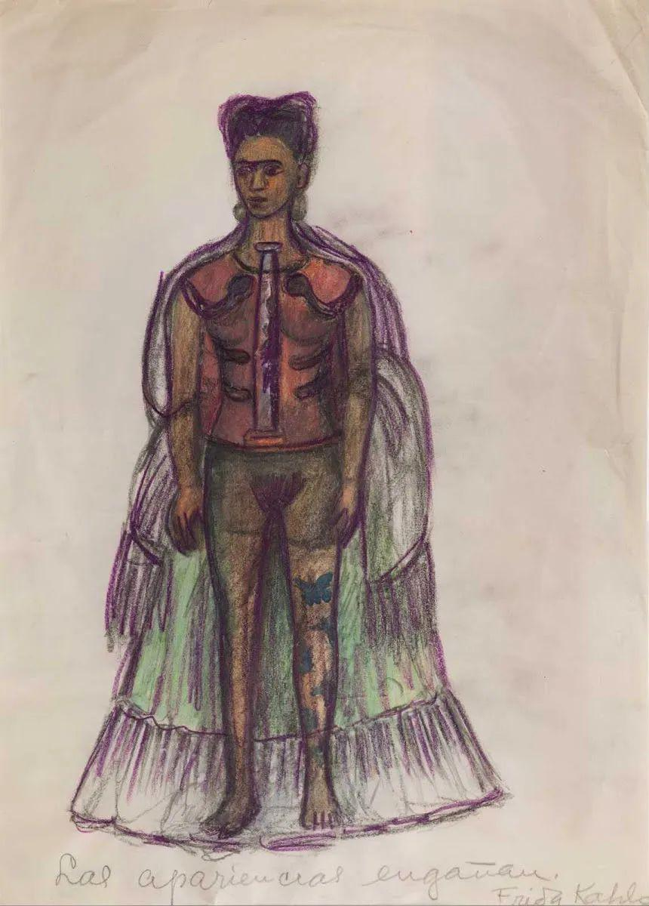

图二十三：《外表是具有欺骗性的》（https://www.brooklynmuseum.org/exhibitions/frida_kahlo）

图二十四：两个弗里达中厚重的裙摆

#### 死亡

​	在墨西哥文化中，死亡具有独特的意义。墨西哥，留存着古老的印第安文明。印第安人认为人死亡后亡灵会进入到另外一个空间，在那个空间里他们如同在现实世界一般生活。每年的亡灵节，亡灵们会通过桥梁回到世间与亲人团聚。因此在墨西哥，亡灵节是一个非常重要的节日，人们会用骷髅进行装饰，也会载歌载舞庆祝与亡灵的相见。墨西哥人擅长给与亡灵相关的神明塑造奇异夸张的形象，这种奇怪而富有特色的形象也为了弗里达绘画一些大胆神奇的形象提供了灵感。

​	除了墨西哥、印第安对死亡的认知，弗里达自己对死亡也有独特的思考。弗里达生前最后一幅作品《生命万岁》呈现了若个个不同状态、不同形状的西瓜（图二十五），阐释了弗里达自己对于生命、人生意义以及死亡的独特见解。在临终前，弗里达留下遗言：“Espero alegre la salida y espero No volver jamás（愿离去是幸,愿永不归来。）”

图二十五：《生命万岁》（https://www.fridakahlo.org/viva-la-vida-watermelons.jsp）

### 超现实主义与现实

​	超现实主义画家安德烈·布勒将弗里达的绘画归为超现实主义，并称弗里达的绘画是“围绕在炸弹周围的丝带”。但弗里达自己却不这么认为。超现实主义一般用梦一般的意象来探索人类脑海中的无意识、本能与梦。而弗里达却认为她画的是发生在她身体上的事实。

### 二元性Duality

​	弗里达的自画像中常常充满了她对自身二元性的探索，尤其是这幅《两个弗里达》。主流的对两个弗里达的解释是：右边穿着传统墨西哥服饰的弗里达是迭戈深爱的弗里达，而左边的弗里达是在欧洲时期的弗里达，是迭戈不爱的弗里达。但笔者以为，弗里达的二元性不仅仅体现在她作为女性在一段爱情中的位置的二元性上，还体现在更多的方面上。

​	弗里达拥有犹太和墨西哥的混血，她的父亲是出生在德国的犹太人，她的母亲是梅斯蒂索人，西班牙和墨西哥原住民的混血女性（图二十六）。双重国家文化背景下出生的弗里达也在自画像中探索自己身上存在的国家文化的二重性。在《两个弗里达》中，左边的弗里达身着维多利亚时期的裙子，类似她母亲在结婚时穿着的欧式婚纱，代表着欧洲文化（图二十七）；而右侧身着墨西哥传统tehuana服饰的弗里达则代表着传统的墨西哥文化。两者的联结表示着两种文化在弗里达个人身上的融合。

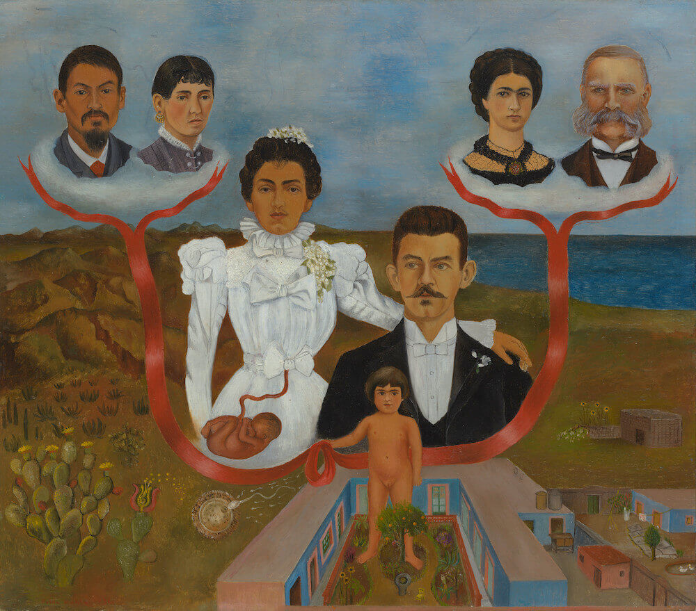

图二十六：祖父母、父母和我（https://www.fridakahlo.org/my-grandparents-my-parents-and-me.jsp）

图二十七：左侧身着维多利亚时期服饰的弗里达与身着白色裙子的弗里达母亲

​	除此之外，弗里达是一个双性恋者，她同时是艺术家也是共产主义者。弗里达在这些性取向、艺术与政治身份的多重构建与切换中，也完成了对自我的独特性气质和行为的构建。

​	值得注意的是，笔者在这幅画中也看出了时间上的二元性。这幅画描述了在过去婚姻生活中的弗里达和现在的弗里达、自我独立的弗里达和依赖他人的弗里达。另外，我们可以看到弗里达在新婚时期绘制的《弗里达与迭戈·里维亚》（图二十八）中，他们的手相握，迭戈·里维亚的手支撑着弗里达。而在这幅弗里达在离婚后创作的《两个弗里达》中，两个弗里达手相握，右边心脏完好的弗里达的手支撑着“破碎”的弗里达（图二十九）。支撑的手的转变，意味着创作《两个弗里达》时期的弗里达，尽管痛苦，但仍然是一个独立、自己支撑自己的女性。

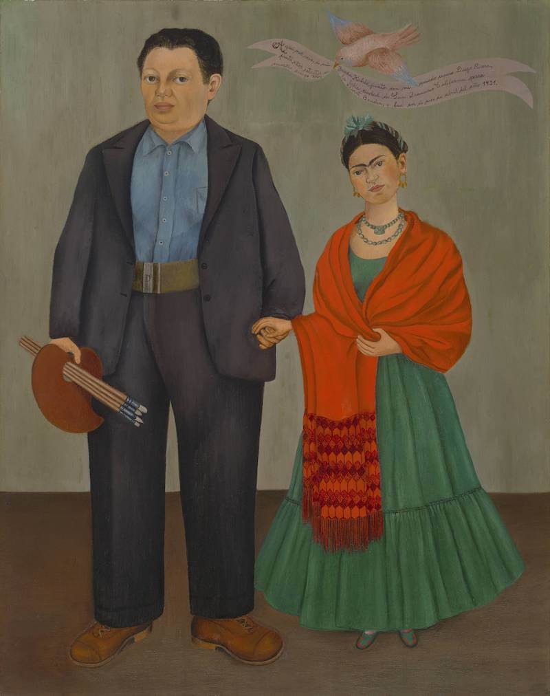

图二十八：《弗里达与迭戈·里维亚》（https://www.fridakahlo.org/frida-and-diego-rivera.jsp）

图二十九：弗里达与迭戈·里维亚的手、两个弗里达的手（截取自《弗里达与迭戈·里维亚》和《两个弗里达》）

## 个人感悟

### 女性笔下的女性——费兰特的《那不勒斯四部曲》与弗里达的《两个弗里达》

#### 视角

​	三年前我第一次阅读到埃莱娜·费兰特的《那不勒斯故事四部曲》（图三十）便被其深深吸引，同时也让我打开了对女性作家作品的大门。那时我突然意识到，课本中学到的著名作家、思想家，绝大部分都是男性（如果是女性，还会特意注明是女作家）。我的阅读习惯、对文学作品的思考全是建立在男性思维的基础上。

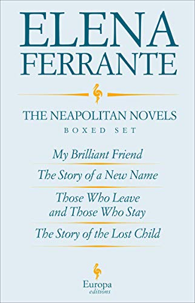

图三十：《那不勒斯故事四部曲》Neapolitan Novels 埃莱娜·费兰特著

​	同样的，在学习《东西方美术巡礼》时，我也意识到，尽管女性经常出现在画作上，她们往往是被投视、被欣赏的对象，而不是创作的主体，也就是拿画笔的那个人。正如同许多伟大的思想家哲学家将女性贬斥为生育的机器、动物一般无思想空洞的躯体，在许多男性创作绘画的画作中，他们笔下的女性也都是单一形象、眼神空洞、没有主张的。这是一些男画家认为女性的美——眼神空洞的、千篇一律单一的、形体身材完美无暇的、柔弱的美。因此，当我看完与弗里达相关的电影、纪录片和传记后，我被这个行事大胆、鲜明而又活力的女性深深吸引，也被她笔下的自画像中的坚毅女性形象所打动。所以，我决定在这次绘画赏析作业中仔细地深度地分析这位在革命后墨西哥由男性主导的艺术圈中崭露头角的女性画家弗里达，笔下的女性，也就是她自己，所拥有的独特思想与美丽。

​	在结合弗里达所处的时代背景分析弗里达的《两个弗里达》时，我意识到我对弗里达绘画作品的喜爱和对埃莱娜·费兰特文学作品的喜爱不仅仅在于她们都是少有的杰出的女性笔下的女性作品，她们在其他方面也有很多共同点。

#### 暴力

​	她们都描述了在她们身上发生的暴力。埃莱娜·费兰特笔下，是莉拉遭受的丈夫的家暴以及意大利老城区中随处可见的暴力与不安，人们随意地在对方身上施加暴力，法西斯、革命、暴力与死亡是恒久的话题。埃莱娜·费兰特书中同样也有另一种暴力，另一个主角埃莱娜在跨越阶层嫁给知识分子后由于社会结构与分工遭受的隐形暴力，因为结婚和生育她失去了工作的空间和时间、失去了对自己身体的掌控权利、被家务琐事照料孩童等母职所填满。在弗里达笔下，她遭受的暴力是疾病的暴力，是瘫痪、残疾带来的肉体与精神的暴力；同时她也遭受着车祸带来的母性生育权丧失的暴力，在她的众多作品中，我们能通过各种意象以及色彩强烈体会到发生在弗里达身上的疾病带来的暴力。

#### 真实物象

​	除此之外，两个艺术家或创作者的作品中最吸引我的都是她们对于自己想法的表达。我钟爱埃莱娜·费兰特笔下大量细腻生动的心理刻画——对城区、教育、革命、女性友谊的心理活动。比如关于界限消失这个概念，书中有这两段描写。

> “在讲述这件事情时，莉拉说那种感觉就是**“界限消失”**，那一次她感觉非常明显，但那不是第一次。比如说，她之前经常有一种感觉，就是在不到一秒的时间里，一个人、一样东西、一个数字或者一个音节，会打破原来的界限，改变形状。那天**她父亲把她扔出窗外**，在她飞向路面的过程中，她很明确地感觉到自己看到一些**红色的小动物**，非常友好，它们**化解了坚硬的路面，使路面变得光滑柔软**。但在庆祝新年的那天夜里，她第一次感觉到周围的一切都变得陌生，感觉到整个世界都打破了它的界限，展示出可怕的本性，这让她非常不安。”

>她想要让我明白，界限消失是怎么回事儿，多么让她害怕。她把我的手握得更紧了，她在喘息。她说，人和东西的界限是很脆弱的，会像棉线一样容易断裂。她小声说，对于她来说，一直都是这样，一样东西的界限消失之后，会落到另一件东西上，**就像是不同材料都融化了，搅在一起，分不清谁是谁了**。她大声说，她一直很难说服自己，生命的界限是很坚固的，因为她从小都知道，事情绝对不是这样的，**因此她没办法相信，这些东西和人是坚固的**，可以抵抗撞击和推搡。这时她又变成另一个极端，她开始说一些过于激动、深奥的话，夹杂着方言词汇，还有之前读的一些书的内容。她嘟囔着说，她永远要保持警惕，一不留神，**那些东西的边缘会发生剧烈、痛苦的变形**，会让她非常恐惧。那些本质的东西会占上风，会掩盖那让她平静的稳定实体，她会陷入一个**黏糊糊的凌乱的世界**，没办法清晰感知。这种**触觉会卷入视觉，视觉会卷入味觉**。“真实的世界是什么样的？莱农，我们现在看到了，我们不能说任何事情是稳定的。”因此，假如她一不小心，假如她不关注那个界限，**洪水将会冲破它所有内部的东西都会崩裂出来，就像经血一样脱落，血肉模糊，还有发黄的筋**。

​	“红色的小动物”、“使地面变得光滑柔软”、“不同材料都融化了”、“剧烈、痛苦的变形”、“触觉会卷入视觉，视觉会卷入味觉”、“经血一样脱落”、“血肉模糊”、“还有发黄的筋”，这些文字都让我想起了弗里达，想起了弗里达笔下的浴缸中的大厦、镜像的流血的脚趾、胎儿与脐带（图三十一、图三十二）。埃莱娜·费兰特笔下的文字像主角生活中真实飞出脑海的片段，而我也确实相信这不仅仅是想象而是一种真实的体验。对于弗里达画作中的这些物象也是如此，我相信这是弗里达的真实生活，而绝非想象。

图三十一：《我所见到的水中景物或水的赐予》（https://www.fridakahlo.org/what-the-water-gave-me.jsp）

图三十二：《亨利福特医院》（https://www.fridakahlo.org/henry-ford-hospital.jsp）

## 参考资料

1. Fernando Antelo. Pain and the Paintbrush: The Life and Art of Frida Kahlo. Virtual Mentor. 2013;15(5):460-465. doi: 10.1001/virtualmentor.2013.15.5.imhl1-1305.
2. Watt, Graham. Frida Kahlo. The British Journal of General Practice vol. 55,517 (2005): 646–647.
3. Taymor, Julie, director. *Frida*. Miramax Films, 2002. 
4. Hayden Herrera. Frida: A Biography of Frida Kahlo.Goodreads. 2002.
5. 王双. 弗里达·卡洛代表作《两个弗里达》作品赏析[J].收藏与投资,2021,12(03):38-41.DOI:10.19897/j.cnki.scytz.2021.03.010.
5. 埃莱娜·费兰特.那不勒斯故事四部曲［Ｍ］.大塊文化. 2017.

